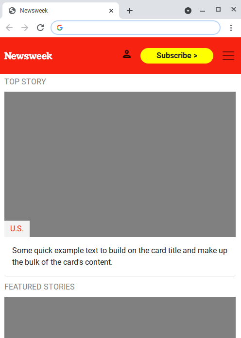
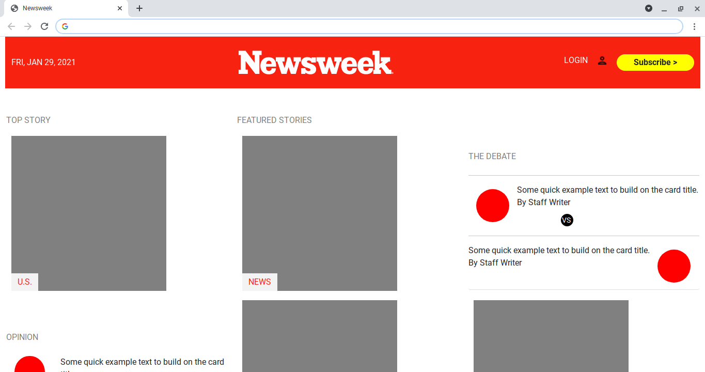

# odin-project-bootstrap
Odin Project HTML/CSS - Bootstrap exercise

[Odin Project](https://theodinproject.com/courses/html-and-css/lessons/using-bootstrap) 
 
[Newsweek](https://www.newsweek.com)
 
[Live Link](https://jdegand.github.io/odin-project-bootstrap/)
 
[Github](https://github.com/twbs/bootstrap/blob/main/site/content/docs/5.0/examples/offcanvas/offcanvas.js_) - Off canvas
 
[Medium](https://medium.com/coder-grrl/the-guide-to-customising-the-bootstrap-4-navbar-i-wish-id-had-6-months-ago-7bc6ce0e3c71) - Customizing bootstrap nav

